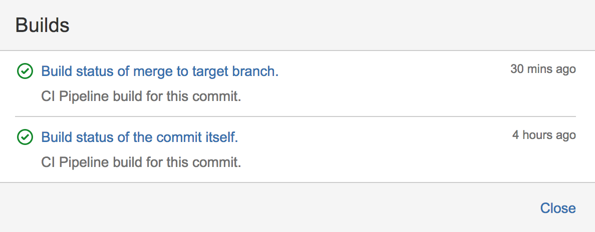

# CI Pipeline and Custom Tools of Android projects at Juno

Article describes almost all components of CI Pipeline we use for our Rider Android app at Juno. Driver team has similar, but slightly different configuration.

Disclaimer:

>Article mostly based on personal opinions of [Artem Zinnatullin][artem_zin], some Juno engineers may not agree with some of them, and it's fine!

#### Table of Contents

- [Overview](#overview)
    - [General Pipeline](#general-pipeline)
    - [Release Candidate and Release Jobs](#release-candidate-and-release-jobs)
- [What Actually Happens on CI](#what-actually-happens-on-ci)
    - [Docker](#docker)
        - [Docker TL;TR](#docker-tltr)
        - [Why Docker](#why-docker)
        - [Docker issues](#docker-issues)
    - [Build Scripts Under Version Control](#build-scripts-under-version-control)
        - [Why store build scripts under version control](#why-store-build-scripts-under-version-control)
        - [How do we organize Build Scripts](#how-we-organize-build-scripts)
        - [Why Bash and not Kotlin Script, etc?](#why-bash-and-not-kotlin-script-etc)
- [Back to "What actually happens on CI"](#back-to-what-actually-happens-on-ci)
        - [Swarmer — our tool to create and start Android Emulators in Parallel](#swarmer)
        - [Composer — our test runner that runs Instrumentation Tests in Parallel and generates HTML Report](#composer)
        - [Jenkinsfile](#jenkinsfile)
- [Bonus Material](#bonus-material)
    - [Why Jenkins](#why-jenkins)
        - [What alternatives did we look into](#what-alternatives-did-we-look-into)
            - [TeamCity](#teamcity)
            - [Concourse](#concourse)
    - [Why Bitbucket Server](#why-bitbucket-server)
    - [Mainframer — How we build apk with source code changes in under 10 seconds during local development](#mainframer)

## Overview


### General Pipeline

General Pipeline builds:

* Every branch in the repo. 
* `pr/*/merge` refs provided by [Bitbucket Server][bitbucket server] (GitHub also have similar feature JFYI).

`pr/*/merge` ref updates each time target branch or PR itself changes. 

This gives us **automatic rebuilds** for Pull Request if branch it is targeting was changed — shortest CI feedback loop possible for a given PR.



Building `pr/*/merge` refs is **essential if you want to have stable dev/master branch**. There are cases (happened 1-2 times a week even in our small team) when merge of a PR will break its target branch because there was logical conflict. 

Real life example: you change some class name in PR1, PR2 used old class name, for Git there might be no conflict at all, however result of merge of both PRs will not even be compilable.

### Release Candidate and Release Jobs

These are separate jobs from the General Pipeline. 

The reason we're keeping them separate is because we didn't find a good way yet to have different "Discard old builds" settings for different "branches" in a Jenkins Pipeline. In our case we generally want to keep builds only for about a week, but release and release candidate builds should be kept forever (just in case, we also have separate git repo for released apks which is very useful for QAs and Developers).

We won't be discussing these jobs in the article, but for the sake of details — they use same `build.sh` infrastructure as General Pipeline (see below) which is nice.

## What actually happens on CI

First of all let's define few major building blocks that allow us to have consistent and reproducible CI builds and then actually combine them into what we really do.

### Docker

We've wrapped all our CI jobs with [Docker][docker] in August 2016 and since then it helped us a lot. There are issues though, but it's worth it.

#### Docker TL;TR

If we abstract away many many details, Docker gives you ability to build Image(s) (think of it as about VM image) and then run instances of Image(s) — Container(s). 

On top of that Docker has DSL to describe how you want to build the Image and tooling to work with them at scale, i.e — have own registry of images, orchestrate Containers and so on and so on.

#### Why Docker

>If you want reproducible builds you need reproducible environment.

Unfortunately, Android SDK and its components were not designed with user-friendly versioning in mind. Many Android SDK components simply don't have a version: `tools`, `platform-tools`, `android-` apis, `extra-android-m2repository` and others, so whenever you update SDK — you get latest versions which may or may not break your build. 

Oh, and if you have a build running and another build on the same machine decided to update Android SDK shared between them — chances are first build will fail because Android SDK may remove files of a component it is updating and then unpack new ones so there is a time window when first build may try to access non-existing Android SDK files.

>New CI machines should be easy to add, old machines should be easy to maintain.

Android SDK update process is not easy and what's even worse is that when you have lots of CI machines it might get out of hand real quick.

With Docker we only need, hm, um, Docker on any given machine! And Java to run Jenkins ~~slave~~ node `jar`. No more nightly Android SDK Update Jobs or searching for those `lib32stdc++6` and `lib32z1` that differs between Linux distros!

Also, Docker is very lightweight in terms of resources consumption in compare to Virtual Machines.

#### Docker issues

However, it'll be unfair to say that Docker did not create any challenges for us:

- Docker image for our project weights about 5 GB (used to be 8). It takes minutes to download and consumes space on disk.
- If your project uses lots of Gradle/Maven dependencies you might want to cache them in the Docker Image to save few minutes for each build. Then you'll need a strategy on updating Image because of dependencies cache miss.
- In certain cases Docker Container may not stop properly and you may see zombie Containers (very rare, but still possible).
- In certain cases Docker Image may not build properly and you may see untagged images that weight gigabytes (pretty rare, definitely possible).
- "No space left on device" will give you few bad evenings.
- Passing hardware devices and GPU + XServer access is complicated, however it worth all 100% for UI tests.
- Running [Docker in Docker][docker in docker 2015] is [still painful in 2017][docker in docker 2017] and you might want to avoid that if possible.

We've solved most of these problems and Dockerization of our build probably deserves whole separate article (ask us in comments/twitter if you want to read about it).

### Build Scripts Under Version Control

Even before Dockerization, we had all our build processes described as [Bash][bash] scripts and stored under version control.

#### Why store build scripts under version control

- Updates to Build Scripts **can and should be reviewed** by teammates as regular PRs.
- Updates to Build Scripts **can and should be tested** in isolation by CI (meta!). You don't want to break all builds, right?
- We can migrate to other CI Server without much troubles since CI Server simply invokes Build Scripts (and we did twice).
- We can change main build tool (Gradle) and involve other tools into build process without updating CI configs.
- This allowed us Dockerize build without changes on CI Server side!
- Everybody can reproduce CI build locally by running script that CI runs.
- Initially we had 6 different build CI Jobs, obviously 99% of build process was the same, storing it in the VCS allowed us to avoid copy-pasting.

#### How we organize build scripts

Build scripts are code, we apply same practices by splitting functionality into files and folder as we do for regular code:

* `ci/build.sh` — entrypoint for our build, it invokes other scripts to prepare Docker image and then starts Docker Container.
* `ci/internal/build.sh` — actual build script that runs inside Docker Container, invokes `./gradlew` and so on.
* `ci/internal/run_ui_tests.sh` — build script that runs our UI Tests inside Docker Container.
* `ci/internal/*.sh` — other scripts related to the build, usually used by `ci/internal/build.sh`.

What also important is that Build Scripts are organized in a way similar to **feature flags** in the app: by setting values of different environment variables you can change behavior of the build. So we can use same `build.sh` entrypoint for different types of builds.

In general: we try to shift execution into Docker Container as soon as possible because there we have more control over environment and can have more tools to work with that we've installed into the Docker Image.

#### Why Bash and not Kotlin Script, etc?

It's fair to say that [Bash][bash] is far, [very far][bash tutorial] from a perfect scripting language. It has lots of caveats and strangies.

However, there are several reasons why we chose it and continued to maintain CI scripts in Bash:

- Availability: We can't launch Docker container directly because we have some pre-setup, so we need a language that runs on most Linux distros out of the box.
- Compatibility: it's pretty easy to write Bash scripts that will work on even relatively old versions of Bash interpreter.
- Usability: Mostly our build scripts check environment variables, concatenate strings and run other processes. This is what Bash was designed for!
- Complexity: If we need to do more complex stuff, like [creating and running Android Emulators in parallel][swarmer], we write it in Kotlin (see [Swarmer][swarmer]) and then invoke it from Bash.

We've tried to migrate some of the scripts to [Kotlin Script][kotlin script], but immediately faced issues:

- Java APIs for launching external processes ~~suck~~ are not very great, even with Kotlin it's painful.
    - Btw we have a library for that: [Commander][commander]
- To run Kotlin Script you need JVM and Kotlin Compiler on a machine
    - Docker may help here, but what if you need a script to start Docker Container in the first place?
- Kotlin Script still [does not have official solution for dependency management][kotlin script depmngmt], even in small scripts you might want to use some third-party library and it's hard to do.
- Bash tends to be faster than Kotlin Script if script is relatively small and not complex:
    - To run `.kts` you need to compile it first, Kotlin Compiler is pretty heavy so it may take a few seconds to just start it.
    - To *actually* run `.kts` you need to launch JVM, which is heavier than Bash interpreter.
    - However if you're doing complex stuff and script runs for a long time, JVM will most likely beat Bash. 
    - However however if you're planning to do complex stuff in a script, you might probably want to extract it in a separate tool and invoke from Bash.

## Back to "What actually happens on CI"

So now that we know about Docker and Build Scripts we can describe how we build our project:

1. CI Pipeline detects change in Source Code Repository
1. CI notifies Source Code Repository about started build
1. CI runs `bash ci/build.sh`
1. `ci/build.sh` prepares Docker Image
     - Either it is already on machine
     - Or it can be pulled from the Docker registry 
     - Or it should be built and pushed to the registry
1. `ci/build.sh` starts Docker Container with workspace mounted as a volume
    - If it's "Build" stage of Pipeline:
        1. Docker Container runs `bash ci/internal/build.sh` as a target command
        1. `ci/internal/build.sh` constructs `./gradlew` invocation with required parameters depending on build feature flags
        1. Gradle builds the app, runs Unit tests (we have lots of them), runs Lint and produces apks
        1. CI stashes resulting `rider-android.apk` and `rider-androidTest.apk` apks so they could be used by "UI Tests" stage of Pipeline
    - If it's "UI Tests" stage of Pipeline:
        1. CI unstashes apks built by "Build" stage of Pipeline
        1. 1. Docker Container also mounts GPU device and XServer and runs `bash ci/internal/run_ui_tests.sh` as a target command
        1. `ci/internal/run_ui_tests.sh` invokes [Swarmer][swarmer] to start Android Emulators in parallel
        1. `ci/internal/run_ui_tests.sh` invokes [Composer][composer] that runs Instrumentation Tests in parallel
1. `ci/internal/collect_artifacts.sh` collects artifacts from different folders to `artifacts` folder
1. CI saves content of `artifacts` folder
1. CI notifies Source Code Repository about finished build 

### Swarmer

[Swarmer][swarmer] is our open source command line tool that creates and starts Android Emulators in parallel.

It is written in Kotlin with RxJava and uses new `avdmanager` tool from SDK, contributions are welcome!

How we use it:

- Config of an emulator is stored under version control, so we apply regular code review process to it.
- Number of emulators to start is provided to `run_ui_tests.sh` as an Environment Variable through Jenkins Node configuration because different machines can run different amount of emulators at a time
- We run Android Emulators in Docker Container. For now all of them launched in the same Container, but we're thinking about launching each one in a separate Container to reduce some problems introduced by Android SDK

[Swarmer][swarmer] is CI independent, so you can use it on Travis, TeamCity, Concourse, CircleCI and other CI systems.

### Composer

[Composer][composer] is our open source command line tool to run Instrumentation Tests in parallel.

And it's our replacement for [Spoon from Square][spoon] (thank you guys for it ❤️, but we overgrew it).

- It installs target and test apks on available emulators/devices in parallel
- It runs Instrumentation Tests in parallel using static sharding (and we're thinking about [dynamic sharding][composer dynamic sharding])
- It does most of the things reactively — ie pull files and collect logs asap, thanks to RxJava
- It saves logcat and instrumentation output of each device
- It saves logcat and instrumentation output of each test
- It pulls screenshots (compatible with [Spoon][spoon] protocol)
- It concisely logs execution process to stout
- It generates JUnit4 report so CI could analyze it
- It generates HTML Report (thanks to Juno Frontend Team) so we could view the results
- Its HTML Report was developed with performance and usabilty in mind (still work in progress though)

### Jenkinsfile

[Jenkinsfile][jenkinsfile] is a [Groovy 😿][groovy] based DSL for describing Pipelines in [Jenkins][jenkins]. 

We've finally migrated to Jenkins Pipeline in the beginning of 2017 and mostly it worked great and better than 6 separate Jobs we had before. Especially with [`stash & unstash`][jenkinsfile stash unstash] feature that allowed us eliminate overhead we had with separate Jobs for UI tests that basically had to build apks from scratch each time and partially repeat what regular build Jobs did.

```groovy
pipeline {

    // Since we don't use any Bitbucket plugin on Jenkins (we've tried, they're all you know, uh…)
    // We need to manually notify Bitbucket about build status.
    // Due to specifics on how Jenkins evaluates the Pipeline we decided to use `master` node for initial notification 
    // So it could do it even if all worker nodes are busy and we can see pending build status on Bitbucket asap.
    agent {
        label 'master'
    }

    stages {
        stage('Notify Bitbucket') {
            steps {
                ansiColor('xterm') {
                    sh 'bash ci/internal/notify_bitbucket.sh INPROGRESS'
                }
            }
        }

        stage('Build') {
            agent {
                label 'docker && no-gpu'
            }

            environment {
                SIGN_RELEASE_AS_DEBUG = 'true'
                DELETE_BUILD_OUTPUT = 'true'
            }

            steps {
                ansiColor('xterm') {
                    sh 'bash ci/build.sh'
                }
                stash includes: 'artifacts/', name: 'build'
            }

            post {
                always {
                    archiveArtifacts artifacts: 'artifacts/'

                    publishHTML(target: [
                        reportName: "Lint",
                        reportDir: "app/build/reports",
                        reportFiles: "lint-results.html",
                        alwaysLinkToLastBuild: false,
                        keepAll: true,
                        allowMissing: false
                    ])

                    junit '**/test-results/**/*.xml'

                    // Too many small files consume inodes on filesystem.
                    sh 'bash ci/internal/delete_build_output.sh'
                }
            }
        }

        stage('UI Tests') {
            agent {
                label 'docker && gpu'
            }

            environment {
                RUN_UI_TESTS_ONLY = 'true'
            }

            steps {
                unstash 'build'
                ansiColor('xterm') {
                    sh 'bash ci/build.sh'
                }
            }

            post {
                always {
                    archiveArtifacts artifacts: 'artifacts/'

                    junit 'artifacts/**/junit4-reports/*.xml'

                    publishHTML(target: [
                        reportName: "Composer",
                        reportDir: "artifacts/composer-output", // Set `composer-output` as root dir to access logs/screenshots/etc from HTML report.
                        reportFiles: "html-report/suites/0.html",
                        alwaysLinkToLastBuild: false,
                        keepAll: true,
                        allowMissing: false
                    ])
                }
            }
        }
    }

    post {
        failure {
            ansiColor('xterm') {
                sh 'bash ci/internal/notify_bitbucket.sh FAILED'
            }
        }

        success {
            ansiColor('xterm') {
                sh 'bash ci/internal/notify_bitbucket.sh SUCCESSFUL'
            }
        }
    }
}
```

## Bonus Material

### Why Jenkins

So… [Jenkins][jenkins] is not perfect by any means, it has weird bugs, we're constantly hitting different limits of its design and we've tryed alternatives several times. 

For instance just recently it corrupted configuration files of many projects in our cluster [JENKINS-44809][jenkins 44809] which resulted in downtime of CI for few hours.

Also, Jenkins' integration with [Bitbucket Server][bitbucket server] is really bad. As you might notice from our [Jenkinsfile](#jenkinsfile), we're actually not using any Jenkins Bitbucket plugin because none of them were able to fit our requirements on building `pr/*/merge` refs, notifying Bitbucket about the build correctly and having good integration with Jenkins Pipeline. We've tried, cried, patched them and threw them away.

Another problem with Jenkins is its Plugins Ecosystem. Amazing how plugins can be good and bad at the same time. We used to have lots of them installed and once a month we had some compatibility issue between them and Jenkins API changes. Since then we've moved almost everything into our Build Scripts and custom tools so our Jenkins instance is on Plugin Diet for a long time now, feels good.

Pipelines themselves are pretty stable now, however [Blue Ocean][jenkins blueocean] UI is still not very reliable, slow and lacks lots of features in compare to old one. Gladly you can use both old and new UIs.

**But**, Jenkins is free (there is [Enterprise version][jenkins enterprise] though) and mostly solves our tasks.

Ideally (in Artem's dreams) company can own one autoscaling CI cluster with Docker on each machine, some Macs for iOS guys and some machines with GPU for our UI Tests and that should be fine for Backend, Frontend, Data Science and Mobile projects of the company. With autoscaling this should be very efficient in both cost and performance.

Fortunately or unfortunately each department has own CI setups and we even have different Jenkins clusters for Android and iOS projects (we could build Android apps on Macs, just saying 😬) so we have isolation which helps in case of CI Server issues (which happens with Jenkins from time to time) but at the same time duplication of work and maintenance, and probably ineficient use of computing resources.

#### What alternatives did we look into

##### [TeamCity][teamcity]

Pros:

- It's mature and stable product made by company we trust
- It has powerful [Pipeline DSL][teamcity pipeline] as well
- Pipeline DSL built on top of Kotlin rather than Groovy
- Supports LDAP
- Reliable real-time web ui

Cons:

- Pricing. 

In our case we would have to pay $3700 for Android CI Cluster + cost of machines. Plus another $3700 for two iOS teams and a shitton more for Backend, Frontend and Data Science teams.

However big autoscaling TeamCity cluster may worth it since it has fine-grained permissions control and allows to use scalable database solutions like PostgreSQL and MySQL resulting in handling hundreds and probably even thousands of projects.

##### [Concourse][concourse]

Pros:

- Unix-way designed CI system
    - Just three concepts: Tasks, Resources and Jobs that cover all the things you need from CI
- Designed for Pipelines
- Made with Containerization in mind
- To add a worker you just need to configure pair of SSH-keys, no JNLP or other pain
- Good HTTP API
- Great command line tool `fly` to control CI without browser
- YML-based Pipeline DSL, great for simple pipelines
- The only way to set configuration is CLI tool or API
- It's free and open source

Cons:

- Web UI made by aliens, you'll need a week or so to get used to it
- Log output [eats all the CPU and can crash Chrome Tabs][concourse log output] while Jenkins renders same log just fine
- Containerization may complicate things:
    - Concourse is designed to run builds in containers like Docker
    - If you have complicated setup you may end up running [Docker in Docker][docker in docker 2015] which never works well at scale 😿
- YML-based Pipeline DSL, bad for sophisticated pipelines
- OAuth-based user management makes it hard to work with existing LDAP infrastructure
- No built-in artifact management: "just upload them to S3 and print url to the build log" they said (It's a great idea but complicates things)

>There are few other options, however for different reasons they were not fitting our needs and not listed here.

### Why [Bitbucket Server][bitbucket server]

Historical reasons. Some of us really love GitHub and will be happy to migrate as soon as possible. There are few things though that Bitbucket is able to do out of the box which GitHub isn't:

- [Automatic branch merging][bitbucket automatic branch merging]. We follow [Git FTFY][git ftfy] branching model and this feature allows us automatically merge changes from say `dev/1.27.0` branch to `dev/1.28.0`.
- [Branch permissions][bitbucket branch permissions]. Gives more fine-grained control over branch and tags permissions than GitHub with support for regexp. Prevents deletion/modification of tags, changes without pull requests for particular branches and so on.

But GitHub has much more small, but important thingies here and there which overall makes it more pleasant to use. 

### [Mainframer][mainframer] — How we build apk with source code changes in under 10 seconds during local development

In 2017 building Android project with Gradle takes minute(s) on top 2017 15'' MacBook Pro, makes it hot and significantly drains battery. Also, laptop is basically unusable during the build time. This is not great.

So we've made a tool that allows you build projects remotely on a much more performant hardware.

TL;TR 3 simple steps:

1. Sync project from local to remote machine (rsync)
1. Execute command on the remote machine (ssh)
1. Sync project from remote to local machine (rsync)

In such a scheme speed of your build depends not on the hardware of your local machine, but on the hardware on your remote machine.

We're using machine with Intel Core i7 6770k, 64 GB of memory and fast SSD that serves both Rider and Driver Android Teams, costs less than a half of one MacBook Pro and saves hours of development time every day!

Guys from [EL Passion][el passion] even made an [IntelliJ Plugin][mainframer intellij plugin] that smoothly integrates Mainframer with IntelliJ's Run Configurations and we use it to build and run apks in Android Studio, as well as compiling and running Unit and Instrumentation tests.

With Kotlin inremental compilation and recent update that made kapt incremental (in many but not all cases) we're able to build apk with source code & resources changes in under 10 seconds including sync time!

So we encourage teams who suffer from slow builds to try [Mainframer][mainframer] and [share results][mainframer share results] with community!

---

## That's it, thank you for reading!

Author: [Artem Zinnatullin][artem_zin]

We use GitHub issues for discussions and comments: https://github.com/gojuno/engineering/issues/3

You can follow this repo to receive updates about new articles from Juno Engineering Team and new comments in discussions.

[bitbucket server]: https://www.atlassian.com/software/bitbucket/server
[docker]: https://www.docker.com/
[docker in docker 2015]: https://jpetazzo.github.io/2015/09/03/do-not-use-docker-in-docker-for-ci/
[docker in docker 2017]: https://github.com/jpetazzo/dind
[bash]: https://en.wikipedia.org/wiki/Bash_%28Unix_shell%29
[bash tutorial]: https://www.ibm.com/developerworks/library/l-bash2/index.html
[kotlin script]: https://kotlinlang.org/docs/tutorials/command-line.html#using-the-command-line-to-run-scripts
[kotlin script depmngmt]: https://youtrack.jetbrains.com/issue/KT-15266
[commander]: https://github.com/gojuno/commander
[swarmer]: https://github.com/gojuno/swarmer
[composer]: https://github.com/gojuno/composer
[spoon]: https://github.com/square/spoon
[composer dynamic sharding]: https://github.com/gojuno/composer/issues/66
[jenkinsfile]: https://jenkins.io/doc/book/pipeline/jenkinsfile/
[groovy]: http://www.groovy-lang.org/
[jenkins]: https://jenkins.io/
[jenkinsfile stash unstash]: https://jenkins.io/doc/pipeline/steps/workflow-basic-steps/#stash-stash-some-files-to-be-used-later-in-the-build
[jenkins 44809]: https://issues.jenkins-ci.org/browse/JENKINS-44809
[jenkins blueocean]: https://jenkins.io/projects/blueocean/
[jenkins enterprise]: https://www.cloudbees.com/products/cloudbees-jenkins-enterprise
[teamcity]: https://www.jetbrains.com/teamcity/
[teamcity pipeline]: https://blog.jetbrains.com/teamcity/2017/02/kotlin-configuration-scripts-extending-the-teamcity-dsl/
[concourse]: https://concourse.ci/introduction.html
[concourse log output]: https://github.com/concourse/concourse/issues/1009
[bitbucket automatic branch merging]: https://confluence.atlassian.com/bitbucketserver/automatic-branch-merging-776639993.html
[bitbucket branch permissions]: https://confluence.atlassian.com/bitbucketserver/using-branch-permissions-776639807.html
[git ftfy]: https://artemzin.com/blog/git-ftfy-branching-model-continuation-of-git-flow-considered-harmful/
[mainframer]: https://github.com/gojuno/mainframer
[el passion]: https://github.com/elpassion
[mainframer intellij plugin]: https://github.com/elpassion/mainframer-intellij-plugin
[mainframer share results]: https://github.com/gojuno/mainframer/issues/17
[artem_zin]: https://twitter.com/artem_zin
